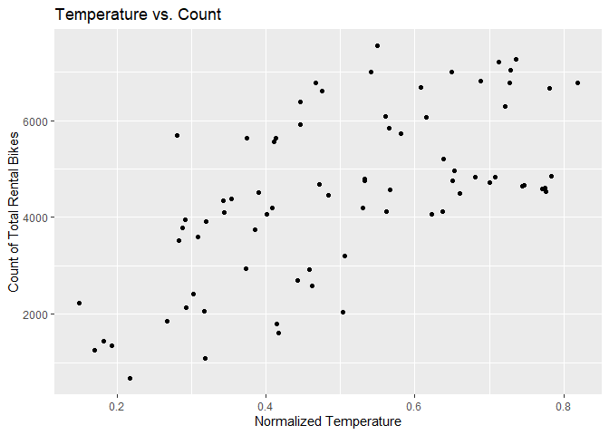
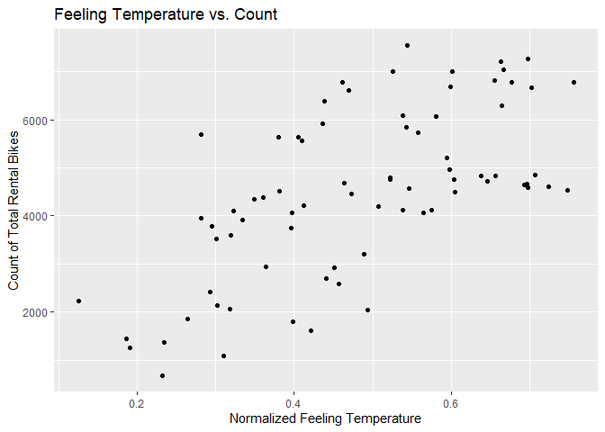
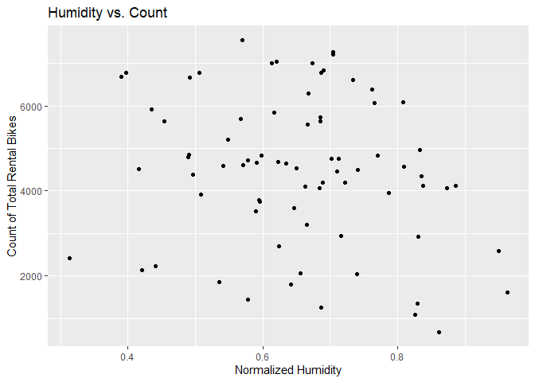
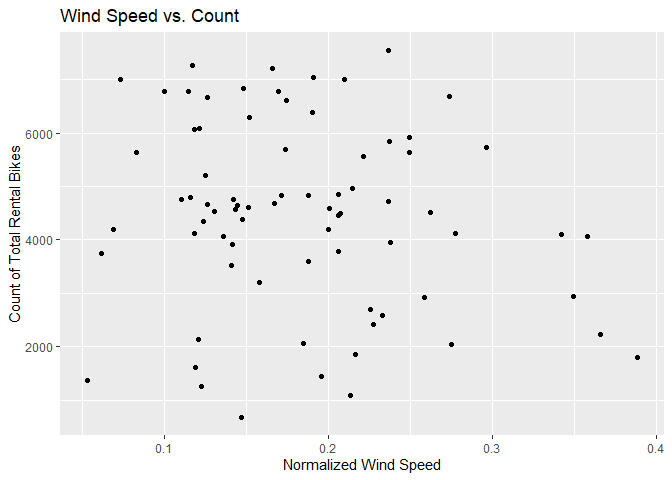

Report for One Day of Week
================

Introduction
============

The data we will be analyzing in this project is a daily count of rental
bikes between years 2011 and 2012 in the Capital bikeshare system. This
bike share data set includes information about the day of rental and the
weather on that particular day. Below is a list of the variables that
will be available for us to include in our models and a brief
description:

-   season : season (1:winter, 2:spring, 3:summer, 4:fall)
-   yr : year (0: 2011, 1:2012)
-   mnth : month ( 1 to 12)
-   holiday : weather day is holiday or not
-   weekday : day of the week
-   workingday : if day is neither weekend nor holiday is 1, otherwise
    is 0
-   weathersit :
    -   1: Clear, Few clouds, Partly cloudy, Partly cloudy
    -   2: Mist + Cloudy, Mist + Broken clouds, Mist + Few clouds, Mist
    -   3: Light Snow, Light Rain + Thunderstorm + Scattered clouds,
        Light Rain + Scattered clouds
    -   4: Heavy Rain + Ice Pallets + Thunderstorm + Mist, Snow + Fog
-   temp : Normalized temperature in Celsius
-   atemp: Normalized feeling temperature in Celsius
-   hum: Normalized humidity
-   windspeed: Normalized wind speed
-   cnt: count of total rental bikes

The purpose of this analysis is to compare two models in terms of their
predictive performance. As this is a regression problem, we will use
RMSE to determine which model is the better fit. The models we will fit
are a non-ensemble tree model and a boosted tree model. Tuning
parameters for both models will be selected using leave one out cross
validation. We will fit both of these models on the training data set
and evaluate the RMSE on the test set.

Packages
========

We will load in our necessary packages, `tidyverse` and `caret`. We will
also set the seed, so our results are reproducible.

    set.seed(123)
    library(tidyverse)
    library(caret)
    library(ggplot2)

Reading in Data
===============

Using the `read_csv` function, we will read in the csv file of the bike
sharing data. With the use of the `select` function, we can remove the
casual and registered variables, which should not be used for modeling,
and any non-numeric variables, like dteday. Finally, using `filter`, we
will filter our data set by the specific day of the week we are
interested in analyzing for that report.

    bikeData <- read_csv("day.csv")
    bikeData <- bikeData %>% select(-c(casual, registered, instant, dteday)) %>% filter(weekday == params$dayofWeek)

Creating Training and Test Split
================================

Using `createDataPartition`, we will partition our data into the 70/30
training and test split.

    bikeDataIndex <- createDataPartition(bikeData$cnt, p = 0.7, list = FALSE)
    bikeDataTrain <- bikeData[bikeDataIndex, ]
    bikeDataTest <- bikeData[-bikeDataIndex, ]

Summarizations of Data
======================

First we will look at the five number summary of each variable.

    summary(bikeDataTrain)

    ##      season            yr              mnth           holiday 
    ##  Min.   :1.000   Min.   :0.0000   Min.   : 1.000   Min.   :0  
    ##  1st Qu.:2.000   1st Qu.:0.0000   1st Qu.: 3.750   1st Qu.:0  
    ##  Median :3.000   Median :0.0000   Median : 7.000   Median :0  
    ##  Mean   :2.605   Mean   :0.4868   Mean   : 6.513   Mean   :0  
    ##  3rd Qu.:4.000   3rd Qu.:1.0000   3rd Qu.:10.000   3rd Qu.:0  
    ##  Max.   :4.000   Max.   :1.0000   Max.   :12.000   Max.   :0  
    ##     weekday    workingday   weathersit         temp       
    ##  Min.   :2   Min.   :1    Min.   :1.000   Min.   :0.1500  
    ##  1st Qu.:2   1st Qu.:1    1st Qu.:1.000   1st Qu.:0.3683  
    ##  Median :2   Median :1    Median :1.000   Median :0.4933  
    ##  Mean   :2   Mean   :1    Mean   :1.447   Mean   :0.5030  
    ##  3rd Qu.:2   3rd Qu.:1    3rd Qu.:2.000   3rd Qu.:0.6515  
    ##  Max.   :2   Max.   :1    Max.   :3.000   Max.   :0.8183  
    ##      atemp             hum           windspeed            cnt      
    ##  Min.   :0.1263   Min.   :0.3142   Min.   :0.05321   Min.   : 683  
    ##  1st Qu.:0.3635   1st Qu.:0.5703   1st Qu.:0.12625   1st Qu.:3579  
    ##  Median :0.4811   Median :0.6644   Median :0.17382   Median :4576  
    ##  Mean   :0.4828   Mean   :0.6525   Mean   :0.18458   Mean   :4487  
    ##  3rd Qu.:0.6017   3rd Qu.:0.7351   3rd Qu.:0.22606   3rd Qu.:5758  
    ##  Max.   :0.7557   Max.   :0.9625   Max.   :0.38807   Max.   :7538

From this output, we can see that the yr, holiday, and workingday day
variables are binary. And the season, mnth, and weathersit are
categorical in nature. So, we will create a contingency table of these
variables and the count of bikes shared. To do this we will use the
`aggregate` function in combination with `kable`. First, a table of the
count and year.

    knitr::kable(aggregate(bikeDataTrain$cnt, by = list(bikeDataTrain$yr), FUN = sum), col.names = c("Year", "Sum of Count"))

| Year | Sum of Count |
|-----:|-------------:|
|    0 |       138056 |
|    1 |       202934 |

We can see that the bike share rented out more bikes in the year 2012,
than 2011. Secondly, we will look at a table of the count and holiday.

    knitr::kable(aggregate(bikeDataTrain$cnt, by = list(bikeDataTrain$holiday), FUN = sum), col.names = c("Holiday", "Sum of Count"))

| Holiday | Sum of Count |
|--------:|-------------:|
|       0 |       340990 |

As expected, this bike sharing company does more business on
non-holidays, as there are more of these days in a year than holidays.
Finally, we will look at the count and working days.

    knitr::kable(aggregate(bikeDataTrain$cnt, by = list(bikeDataTrain$workingday), FUN = sum), col.names = c("Working Day", "Sum of Count"))

| Working Day | Sum of Count |
|------------:|-------------:|
|           1 |       340990 |

    knitr::kable(aggregate(bikeDataTrain$cnt, by = list(bikeDataTrain$season), FUN = sum), col.names = c("Season", "Sum of Count"))

| Season | Sum of Count |
|-------:|-------------:|
|      1 |        52427 |
|      2 |        86025 |
|      3 |       106546 |
|      4 |        95992 |

    knitr::kable(aggregate(bikeDataTrain$cnt, by = list(bikeDataTrain$mnth), FUN = sum), col.names = c("Month", "Sum of Count"))

| Month | Sum of Count |
|------:|-------------:|
|     1 |        19563 |
|     2 |        14884 |
|     3 |        23108 |
|     4 |        32047 |
|     5 |        25219 |
|     6 |        33114 |
|     7 |        40748 |
|     8 |        47479 |
|     9 |        20494 |
|    10 |        25942 |
|    11 |        36362 |
|    12 |        22030 |

    knitr::kable(aggregate(bikeDataTrain$cnt, by = list(bikeDataTrain$weathersit), FUN = sum), col.names = c("Weather", "Sum of Count"))

| Weather | Sum of Count |
|--------:|-------------:|
|       1 |       217212 |
|       2 |       119577 |
|       3 |         4201 |

The count is higher for the weekdays, rather than the weekends, this
suggests that bike sharing may be becoming a popular option for the work
commute. Now, we will create some histograms of the remaining predictors
vs the reponse.

    g <- ggplot(bikeDataTrain, aes(x = temp, y = cnt))
    g + geom_jitter() + labs(x = "Normalized Temperature", y = "Count of Total Rental Bikes", title = "Temperature vs. Count")

<!-- -->

    g <- ggplot(bikeDataTrain, aes(x = atemp, y = cnt))
    g + geom_jitter() + labs(x = "Normalized Feeling Temperature", y = "Count of Total Rental Bikes", title = "Feeling Temperature vs. Count")

<!-- -->

    g <- ggplot(bikeDataTrain, aes(x = hum, y = cnt))
    g + geom_jitter() + labs(x = "Normalized Humidity", y = "Count of Total Rental Bikes", title = "Humidity vs. Count")

<!-- -->

    g <- ggplot(bikeDataTrain, aes(x = windspeed, y = cnt))
    g + geom_jitter() + labs(x = "Normalized Wind Speed", y = "Count of Total Rental Bikes", title = "Wind Speed vs. Count")

<!-- -->

Models
======

Now that we have read in our data, created our split, and done some
exploratory data analysis, we will begin fitting our models. The goal is
to create two models that predict the cnt variable in our data set.

Nonensemble Tree Model
----------------------

The first model we will fit is a regression tree. The main idea of this
model is to split up our predictor space into regions, and for a given
region, use the main of the observations as our predictor value. For the
fitting process of this model, we will use leave one out cross
validation. For LOOCV, one observation is removed and the model is fit
on the remaining data, and this fit is used to predict the value of the
deleted observation. We repeated this process for each observation and
compute the mean square error. The data was also centered and scaled
using the `preProcess` function. The final choosen model will be the one
that minimzes the training RMSE. For the tuning parameter of cp, we will
use the default values rather than providing a grid of tuning
parameters.

    (treeFit <- train(cnt ~ ., data = bikeDataTrain,
                   method = "rpart",
                   preProcess = c("center", "scale"),
                   trControl = trainControl(method = "LOOCV")))

    ## CART 
    ## 
    ## 76 samples
    ## 11 predictors
    ## 
    ## Pre-processing: centered (11), scaled (11) 
    ## Resampling: Leave-One-Out Cross-Validation 
    ## Summary of sample sizes: 75, 75, 75, 75, 75, 75, ... 
    ## Resampling results across tuning parameters:
    ## 
    ##   cp         RMSE      Rsquared    MAE     
    ##   0.1036507  1369.773  0.38323464  1113.144
    ##   0.2323405  1746.506  0.09209851  1478.889
    ##   0.3597925  2064.711  0.05991941  1796.065
    ## 
    ## RMSE was used to select the optimal model using the smallest value.
    ## The final value used for the model was cp = 0.1036507.

The optimal model in this case used cp = 0.1036507. And we can see the
training RMSE obtained in the output above.

Boosted Tree Model
------------------

The final model we will fit is a boosted tree. This model builds off of
the previous in that we are sequentially fitting tree models. Each
subsequent tree is grown on a modified version of the training data, and
we update our predictions as the tree grows. For the fitting process of
this model, we will use leave one out cross validation. For LOOCV, one
observation is removed and the model is fit on the remaining data, and
this fit is used to predict the value of the deleted observation. We
repeated this process for each observation and compute the mean square
error. The data was also centered and scaled using the `preProcess`
function. The final choosen model will be the one that minimzes the
training RMSE. For the tuning parameters of number of trees, depth,
shrinkage, and minimum number of observations in a node, we will use the
default values rather than providing a grid of tuning parameters.

    (boostedtreeFit <- train(cnt ~ ., data = bikeDataTrain,
                   method = "gbm",
                   preProcess = c("center", "scale"),
                   trControl = trainControl(method = "LOOCV"),
                   verbose = FALSE))

    ## Stochastic Gradient Boosting 
    ## 
    ## 76 samples
    ## 11 predictors
    ## 
    ## Pre-processing: centered (11), scaled (11) 
    ## Resampling: Leave-One-Out Cross-Validation 
    ## Summary of sample sizes: 75, 75, 75, 75, 75, 75, ... 
    ## Resampling results across tuning parameters:
    ## 
    ##   n.trees  interaction.depth  RMSE      Rsquared   MAE     
    ##    50      1                  821.3231  0.7935209  616.3120
    ##    50      2                  742.2997  0.8221043  542.4194
    ##    50      3                  752.0233  0.8141625  550.3582
    ##   100      1                  723.3470  0.8258907  534.9620
    ##   100      2                  676.1392  0.8472783  481.9990
    ##   100      3                  720.8268  0.8249094  521.2320
    ##   150      1                  702.7657  0.8345492  510.5822
    ##   150      2                  670.1005  0.8489998  468.9638
    ##   150      3                  707.9577  0.8310714  504.8152
    ## 
    ## Tuning parameter 'shrinkage' was held constant at a value of
    ##  0.1
    ## Tuning parameter 'n.minobsinnode' was held constant at a
    ##  value of 10
    ## RMSE was used to select the optimal model using the smallest value.
    ## The final values used for the model were n.trees =
    ##  150, interaction.depth = 2, shrinkage = 0.1 and n.minobsinnode = 10.

The optimal model in this case used n.trees = 150, interaction.depth =
2, shrinkage = 0.1, and n.minosbinnode = 10. And we can see the training
RMSE obtained in the output above.

Testing Models on Test Set
==========================

Now that we have determined the optimal fit of each model, we will apply
our models to the test set. First, we will obtain the test RMSE of the
tree model using `predict` and `postResample`.

    treePred <- predict(treeFit, newdata = bikeDataTest)
    (treeResults <- postResample(treePred, bikeDataTest$cnt))

    ##         RMSE     Rsquared          MAE 
    ## 1298.3483519    0.6148503 1138.3045455

Again, we will use `predict` and `postResample` to obtain the test RMSE
of the boosted tree model.

    boostedtreePred <- predict(boostedtreeFit, newdata = bikeDataTest)
    (boostedtreeResults <- postResample(boostedtreePred, bikeDataTest$cnt))

    ##        RMSE    Rsquared         MAE 
    ## 857.4251850   0.8284982 674.0885991

The optimal model in this case is the boosted tree.
